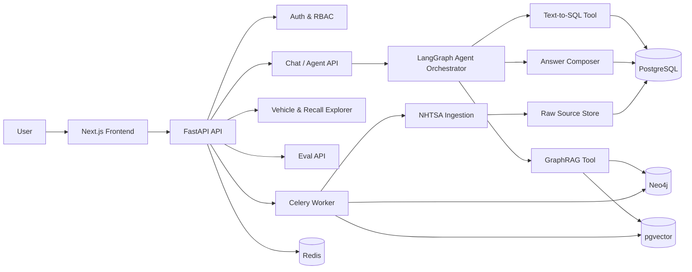
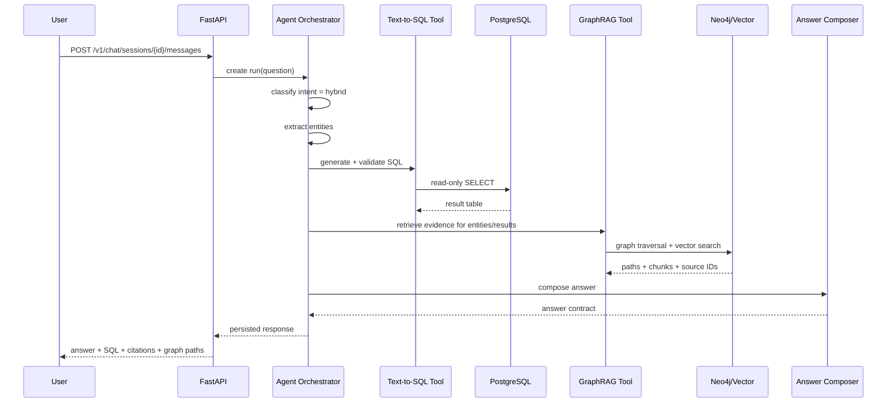

# 01 — System Architecture

## Architecture style

Start with a **modular monolith backend** and separate data services. This keeps the repo simple enough for a side project while preserving clean production boundaries.

```text
Next.js UI
  ↓
FastAPI Backend
  ├── Auth / sessions
  ├── Vehicle explorer APIs
  ├── Chat / agent APIs
  ├── Ingestion admin APIs
  ├── Evaluation APIs
  └── Observability APIs
       ↓
Application services
  ├── Ingestion service
  ├── Normalization service
  ├── Text-to-SQL service
  ├── GraphRAG service
  ├── Agent orchestrator
  ├── Citation resolver
  └── Eval runner
       ↓
Data layer
  ├── PostgreSQL: structured data, app state, run logs
  ├── pgvector: document chunk embeddings, optional first vector store
  ├── Neo4j: graph entities and relationship traversal
  └── Redis: async jobs, cache, rate limiting
```

## Target container architecture



## Core modules

### `app.api`

FastAPI routers. No business logic inside route handlers except request validation and response formatting.

### `app.domain`

Domain models and pure logic: vehicles, complaints, recalls, investigations, manufacturer communications, components, citations.

### `app.ingestion`

Download, parse, stage, validate, normalize, and load NHTSA datasets. Must be idempotent.

### `app.sql_analyst`

Schema-aware SQL generation, validation, execution, and result normalization.

### `app.graph_rag`

Entity linking, graph traversal, vector retrieval, reranking, source resolution.

### `app.agent`

Intent classification, planning, tool orchestration, answer synthesis, confidence checks.

### `app.eval`

Golden question loading, eval run execution, metric calculation, failure analysis.

### `app.observability`

Agent runs, tool calls, latency, SQL, retrieval results, citations, warnings, error traces.

## Request lifecycle: hybrid question



## Deployment stages

### Stage 1 — Local Docker Compose

Required for Phase 0/1.

Services:

```text
api
worker
postgres
redis
neo4j
frontend optional
```

### Stage 2 — Single-cloud deployment

Deploy API, worker, Redis, PostgreSQL, Neo4j, and frontend. Use managed Postgres if available. Neo4j can be self-hosted or AuraDB later.

### Stage 3 — Production hardening

Add auth, RBAC, rate limits, structured logs, eval dashboard, monitoring, backup/restore, and deployment smoke tests.

## Architecture principle

Every feature must preserve this chain:

```text
question → tool plan → SQL/retrieval evidence → citations → caveats → persisted trace
```

If a response cannot expose evidence, it is not production-grade enough for this project.
