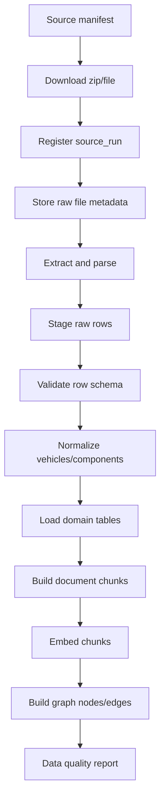

# 02 — Data Sources and Ingestion

## Official source strategy

Use public NHTSA sources as the data backbone:

1. Complaints
2. Recalls
3. Investigations
4. Manufacturer Communications / Technical Service Bulletins
5. Vehicle metadata through vPIC

## Bulk versus API usage

### Use flat files for bulk ingestion

The ingestion pipeline should prefer downloadable NHTSA flat files because they are designed for dataset-level access and can be processed idempotently.

### Use APIs for probes and targeted lookup

Use API endpoints for smoke tests, UI examples, and targeted records:

```text
/complaints/complaintsByVehicle?make={MAKE}&model={MODEL}&modelYear={YEAR}
/complaints/odinumber?odinumber={ODI_NUMBER}
/recalls/recallsByVehicle?make={MAKE}&model={MODEL}&modelYear={YEAR}
/recalls/campaignNumber?campaignNumber={CAMPAIGN_NUMBER}
/products/vehicle/modelYears?issueType=c|r
/products/vehicle/makes?modelYear={YEAR}&issueType=c|r
/products/vehicle/models?modelYear={YEAR}&make={MAKE}&issueType=c|r
```

## Ingestion pipeline



## Source manifest

Create `config/nhtsa_sources.yml`:

```yaml
complaints:
  enabled: true
  mode: flat_file
  years:
    - 2020-2024
    - 2025-2026
  source_type: nhtsa_flat_file

recalls:
  enabled: true
  mode: flat_file
  scope: post_2010
  filter_model_years: [2020, 2021, 2022, 2023, 2024, 2025, 2026]

manufacturer_communications:
  enabled: true
  mode: flat_file
  years:
    - 2020-2024
    - 2025-2026

investigations:
  enabled: true
  mode: flat_file

vpic:
  enabled: true
  mode: api_probe
  bulk_vin_lookup: false
```

## Raw/staging tables

### `source_runs`

Tracks every ingestion attempt.

```text
id
source_name
source_url
source_type
file_name
file_sha256
started_at
finished_at
status
row_count
error_message
metadata_json
```

### `raw_source_files`

Stores file metadata, not necessarily file bytes.

```text
id
source_run_id
source_name
downloaded_at
file_name
file_path
sha256
size_bytes
content_type
```

### `raw_source_rows`

Generic staging table for parsed records.

```text
id
source_run_id
source_name
source_record_key
row_number
raw_json
created_at
```

## Normalization rules

### Vehicle normalization

Normalize make/model/year into a canonical vehicle row.

```text
normalized_make = upper(trim(make))
normalized_model = upper(trim(model)) with whitespace collapsed
model_year = integer
```

### Component normalization

Normalize NHTSA components into canonical component names.

```text
SERVICE BRAKES
STEERING
AIR BAGS
ELECTRICAL SYSTEM
FORWARD COLLISION AVOIDANCE
POWER TRAIN
ENGINE
STRUCTURE
UNKNOWN OR OTHER
```

Keep the original source component string in each source record for traceability.

### Source record IDs

Use stable unique keys:

```text
complaint: ODI number if available, otherwise hash(source_name + raw row)
recall: NHTSA campaign number + affected vehicle fields
investigation: investigation number
manufacturer communication: communication number + vehicle/component fields
```

## Data quality checks

Minimum checks for Phase 1:

```text
row_count > 0 for each enabled source
null rate for key IDs reported
make/model/year parse rate reported
component parse rate reported
duplicate source_record_key count reported
invalid date count reported
sample records stored for each source
```

## Data quality output

Create a markdown report per run:

```text
docs/runs/ingestion_YYYYMMDD_HHMMSS.md
```

Required sections:

```text
Source files
Row counts
Parse errors
Duplicate counts
Null key fields
Top makes
Top components
Known limitations
Verdict: PASS / PASS_WITH_WARNINGS / FAIL
```

## Phase 1 ingestion target

A successful first ingestion should load enough data to answer:

```text
Top complaint components for Ford F-150 2022
Recall list for Honda Accord 2021
Complaint trend by model year for Toyota Camry 2020–2026
Manufacturer communications for one selected vehicle/component
```
